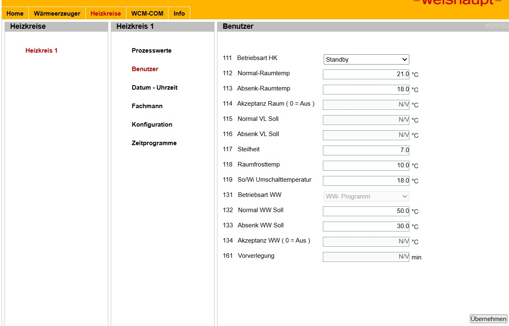

# Weishaupt WCM-COM — Home Assistant Integration

[](https://github.com/hacs/integration)
[](https://github.com/4gismo/HA-Weishaupt-WCM-COM/releases)
[](LICENSE)

---

🇩🇪 [Deutsche Version](#deutsche-version) &nbsp;|&nbsp; 🇬🇧 [English Version](#english-version)

---

## Deutsche Version

Custom Integration für Weishaupt Heizungsanlagen mit **WCM-COM** Netzwerkmodul. Liest Live-Prozesswerte direkt aus dem Gerät über das lokale Netzwerk — ohne Cloud, ohne Abo.

> Basiert auf [phamels/HA-Weishaupt-WCM-COM](https://github.com/phamels/HA-Weishaupt-WCM-COM)

### Geräteschnittstelle

Die Integration liest direkt von der WCM-COM Weboberfläche:




### Voraussetzungen

- Weishaupt Heizung mit **WCM-COM** Netzwerkmodul
- WCM-COM im lokalen Netzwerk erreichbar (IP-Adresse bekannt)
- Zugangsdaten des WCM-COM (Benutzername / Passwort — steht auf dem Aufkleber am Modul oder wurde vom Installateur gesetzt)

### Funktionen

- **22 Sensor-Entities**, **6 Binärsensoren**, **1 Auswahl-Entity** (Betriebsart) und **1 Schalter**
- **Vollständig zweisprachig** — Entitynamen folgen automatisch der HA-Spracheinstellung (Deutsch / Englisch)
- **Betriebsart HK umschalten** — direkt aus HA heraus setzen (Standby, Normal, Absenk, Sommer, Programm 1–3, Wie Leitstelle)
- **Polling-Pause-Schalter** — stoppt die Abfrage durch HA, damit du dich direkt per Browser an der Heizung einloggen kannst (WCM-COM erlaubt nur einen aktiven Nutzer gleichzeitig)
- Lokale Abfrage per HTTP — keine Cloud-Abhängigkeit
- HACS-kompatibel, UI-basierte Einrichtung

### Entities

#### Temperaturen

| Entity | Beschreibung | Einheit |
|---|---|---|
| Vorlauftemperatur | Vorlauftemperatur (eSTB) | °C |
| Rücklauftemperatur | Rücklauftemperatur | °C |
| Außentemperatur | Außensensor | °C |
| Warmwassertemperatur | Brauchwassertemperatur | °C |
| Abgastemperatur | Abgastemperatur | °C |
| Wärmeanforderung | Aktueller Wärmeanforderungs-Sollwert | °C |
| Normal-Raumtemp | Sollwert Normaltemperatur Raum | °C |
| Absenk-Raumtemp | Sollwert Absenktemperatur Raum | °C |
| Min. VL Soll | Minimaler Vorlauftemperatur-Sollwert | °C |
| Max. VL Soll | Maximaler Vorlauftemperatur-Sollwert | °C |
| Schaltdifferenz VL | Hysterese Vorlauftemperatur | °C |
| Anlagenfrostschutz | Frostschutztemperatur Anlage | °C |

#### Betrieb & Status

| Entity | Beschreibung | Einheit |
|---|---|---|
| Betriebsphase | Aktuelle Betriebsphase | — |
| Fehler | Aktiver Fehlercode | — |
| Laststellung | Aktuelle Brennerlast | % |
| Max. Leistung WW | Maximale Leistung Warmwasser | % |
| Brenner Taktsperre | Mindestpause zwischen Brennerstarts | min |
| Max. Ladezeit WW | Maximale Warmwasser-Ladezeit | min |
| Ölzähler | Ölverbrauchszähler | L |
| Brennerstarts | Gesamtzahl Brennerstarts | — |
| Brennerstunden | Gesamte Brennerstunden | h |
| Zeit seit letzter Wartung | Stunden seit letztem Service | h |

#### Binärsensoren

| Entity | Beschreibung | Zustände |
|---|---|---|
| Flamme | Brennerflamme | Ein / Aus |
| Pumpe | Umwälzpumpe | Ein / Aus |
| Heizung | Heizkreis aktiv | Ein / Aus |
| Warmwasser | Warmwasserkreis aktiv | Ein / Aus |
| Gasventil 1 | Gasventil 1 | Offen / Geschlossen |
| Gasventil 2 | Gasventil 2 | Offen / Geschlossen |

#### Auswahl

| Entity | Beschreibung | Optionen |
|---|---|---|
| Betriebsart HK | Betriebsart Heizkreis 1 (les- und schreibbar) | Standby, Normal, Absenk, Sommer, Programm 1–3, Wie Leitstelle |

#### Schalter

| Entity | Beschreibung |
|---|---|
| Polling | Abfrage durch HA pausieren / fortsetzen |

### Installation

#### Option 1: HACS (empfohlen)

1. HACS → Integrationen → **⋮ → Benutzerdefinierte Repositories**
2. URL `https://github.com/4gismo/HA-Weishaupt-WCM-COM` hinzufügen, Kategorie: **Integration**
3. **Weishaupt WCM-COM** installieren und HA neu starten
4. **Einstellungen → Geräte & Dienste → Integration hinzufügen** → *Weishaupt* suchen

#### Option 2: Manuell

1. Ordner `custom_components/weishaupt_wcm_com/` in dein HA-Konfigurationsverzeichnis kopieren
2. HA neu starten → Integration wie oben hinzufügen

### Konfiguration

Nach dem Hinzufügen der Integration folgende Daten eingeben:

| Feld | Beschreibung |
|---|---|
| Host | IP-Adresse des WCM-COM Moduls |
| Benutzername | WCM-COM Login-Benutzername |
| Passwort | WCM-COM Login-Passwort |

Die Integration testet die Verbindung beim Einrichten — bei falschen Zugangsdaten erscheint eine Fehlermeldung.

### Polling-Pause

Das WCM-COM Modul erlaubt nur **einen aktiven Nutzer gleichzeitig**. Solange HA das Gerät abfragt, ist kein direkter Browser-Login möglich.

Nutze den **Polling**-Schalter:
- Schalter **Aus** → HA sendet keine Anfragen mehr → Browser-Login funktioniert
- Schalter **Ein** → normale Abfrage läuft wieder

Da jede Anfrage neu per HTTP Digest Auth authentifiziert wird (keine persistente Session), reicht das Pausieren — kein explizites Ausloggen notwendig.

### Lovelace-Beispiel

```yaml
type: vertical-stack
cards:
  - type: entities
    title: Weishaupt Heizung
    entities:
      - entity: sensor.weishaupt_wcm_com_vorlauftemperatur
      - entity: sensor.weishaupt_wcm_com_aussentemperatur
      - entity: sensor.weishaupt_wcm_com_warmwassertemperatur
      - entity: sensor.weishaupt_wcm_com_laststellung
      - entity: binary_sensor.weishaupt_wcm_com_flamme
      - entity: select.weishaupt_wcm_com_betriebsart_hk
      - entity: switch.weishaupt_wcm_com_polling
  - type: history-graph
    title: Temperaturen (24h)
    hours_to_show: 24
    entities:
      - entity: sensor.weishaupt_wcm_com_vorlauftemperatur
      - entity: sensor.weishaupt_wcm_com_aussentemperatur
      - entity: sensor.weishaupt_wcm_com_warmwassertemperatur
```

### Debugging

Debug-Logging in `configuration.yaml` aktivieren:

```yaml
logger:
  default: warning
  logs:
    custom_components.weishaupt_wcm_com: debug
```

Logs unter **Einstellungen → System → Protokolle**.

### Fehlerbehebung

| Symptom | Mögliche Ursache |
|---|---|
| `WCM-COM not reachable` | Falsche IP-Adresse, Gerät offline oder Port 80 geblockt |
| `WCM-COM auth or HTTP error` | Falscher Benutzername oder Passwort |
| `WCM-COM request timed out` | Gerät antwortet nicht — Standard-Timeout 5 Sekunden |
| Sensoren zeigen `Unbekannt` | Logs auf spezifischen Fehler prüfen |
| Browser-Login nicht möglich | **Polling**-Schalter in HA auf **Aus** stellen |

---

## English Version

Custom integration for Weishaupt heating systems equipped with the **WCM-COM** network module. Reads live process values directly from the device over your local network — no cloud, no subscription.

> Forked from [phamels/HA-Weishaupt-WCM-COM](https://github.com/phamels/HA-Weishaupt-WCM-COM)

### Device Interface

The integration reads directly from the WCM-COM web interface:


### Requirements

- Weishaupt heating system with **WCM-COM** network module
- WCM-COM reachable on your local network (IP address required)
- WCM-COM login credentials (username / password — found on the device label or set by your installer)

### Features

- **22 sensor entities**, **6 binary sensors**, **1 select entity** (operating mode) and **1 switch**
- **Fully bilingual** — entity names follow the HA language setting automatically (German / English)
- **Set operating mode** — switch the heating circuit mode directly from HA (Standby, Normal, Setback, Summer, Program 1–3, Follow Master)
- **Polling pause switch** — temporarily stops HA from querying the device so you can log in directly via browser (WCM-COM only allows one active user at a time)
- Local polling via HTTP — no cloud dependency
- HACS compatible, UI-based setup

### Entities

#### Temperatures

| Entity | Description | Unit |
|---|---|---|
| Flow Temperature | Supply line temperature (Vorlauf) | °C |
| Return Temperature | Return line temperature | °C |
| Outside Temperature | Outside sensor | °C |
| Warm Water Temperature | Domestic hot water | °C |
| Flue Gas Temperature | Exhaust / flue gas | °C |
| Heat Demand | Current heat demand setpoint | °C |
| Normal Room Temp | Normal room temperature setpoint | °C |
| Setback Room Temp | Setback room temperature setpoint | °C |
| Min. Flow Temp Target | Minimum flow temperature setpoint | °C |
| Max. Flow Temp Target | Maximum flow temperature setpoint | °C |
| Flow Temp Hysteresis | Flow temperature switching hysteresis | °C |
| System Frost Protection | System frost protection temperature | °C |

#### Operation & Status

| Entity | Description | Unit |
|---|---|---|
| Operating Phase | Current operating phase | — |
| Error | Active error code | — |
| Burner Load | Current burner load | % |
| Max. DHW Output | Maximum domestic hot water output | % |
| Burner Lockout Time | Minimum pause between burner starts | min |
| Max. DHW Charge Time | Maximum DHW charge duration | min |
| Oil Meter | Oil consumption counter | L |
| Burner Starts | Total burner start count | — |
| Burner Hours | Total burner operating hours | h |
| Time Since Last Service | Hours since last service | h |

#### Binary Sensors

| Entity | Description | States |
|---|---|---|
| Flame | Burner flame | On / Off |
| Pump | Circulation pump | On / Off |
| Heating | Heating circuit active | On / Off |
| Warm Water | Hot water circuit active | On / Off |
| Gas Valve 1 | Gas valve 1 | Open / Closed |
| Gas Valve 2 | Gas valve 2 | Open / Closed |

#### Select

| Entity | Description | Options |
|---|---|---|
| Operating Mode HK | Heating circuit 1 mode (readable and writable) | Standby, Normal, Setback, Summer, Program 1–3, Follow Master |

#### Switch

| Entity | Description |
|---|---|
| Polling | Pause / resume HA polling of the device |

### Installation

#### Option 1: HACS (recommended)

1. In HACS go to **Integrations → ⋮ → Custom repositories**
2. Add `https://github.com/4gismo/HA-Weishaupt-WCM-COM`, category: **Integration**
3. Install **Weishaupt WCM-COM** and restart Home Assistant
4. Go to **Settings → Devices & Services → Add Integration** and search for *Weishaupt*

#### Option 2: Manual

1. Copy `custom_components/weishaupt_wcm_com/` to your HA config directory
2. Restart Home Assistant and add the integration as above

### Configuration

After adding the integration, enter:

| Field | Description |
|---|---|
| Host | IP address of your WCM-COM module |
| Username | WCM-COM login username |
| Password | WCM-COM login password |

The integration tests the connection during setup and shows an error message if the credentials are wrong.

### Polling Pause

The WCM-COM module only allows **one active user at a time**. While Home Assistant is polling the device, you cannot log in through the browser simultaneously.

Use the **Polling** switch:
- Switch **off** → HA stops sending requests → browser login works
- Switch **on** → normal polling resumes

Since there is no persistent session (every request re-authenticates via HTTP Digest Auth), turning off polling is sufficient — no explicit logout needed.

### Example Lovelace Dashboard

```yaml
type: vertical-stack
cards:
  - type: entities
    title: Weishaupt Heating
    entities:
      - entity: sensor.weishaupt_wcm_com_flow_temperature
      - entity: sensor.weishaupt_wcm_com_outside_temperature
      - entity: sensor.weishaupt_wcm_com_warm_water_temperature
      - entity: sensor.weishaupt_wcm_com_burner_load
      - entity: binary_sensor.weishaupt_wcm_com_flame
      - entity: select.weishaupt_wcm_com_operating_mode_hk
      - entity: switch.weishaupt_wcm_com_polling
  - type: history-graph
    title: Temperatures (24h)
    hours_to_show: 24
    entities:
      - entity: sensor.weishaupt_wcm_com_flow_temperature
      - entity: sensor.weishaupt_wcm_com_outside_temperature
      - entity: sensor.weishaupt_wcm_com_warm_water_temperature
```

### Debugging

Enable detailed logging in `configuration.yaml`:

```yaml
logger:
  default: warning
  logs:
    custom_components.weishaupt_wcm_com: debug
```

Logs are visible under **Settings → System → Logs**.

### Troubleshooting

| Symptom | Likely cause |
|---|---|
| `WCM-COM not reachable` | Wrong IP, device offline, or firewall blocking port 80 |
| `WCM-COM auth or HTTP error` | Wrong username or password |
| `WCM-COM request timed out` | Device not responding — default timeout 5 seconds |
| Sensors show `unknown` | Check logs for the specific error above |
| Cannot log in via browser | Turn the **Polling** switch **off** first |

---

## License

Apache License 2.0 — see [LICENSE](LICENSE)
